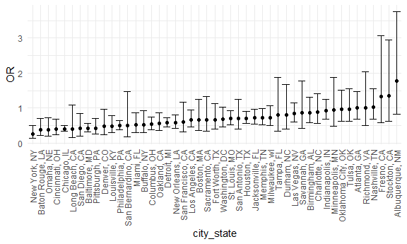
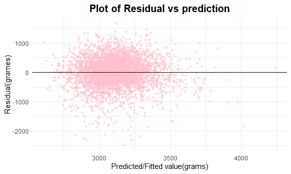
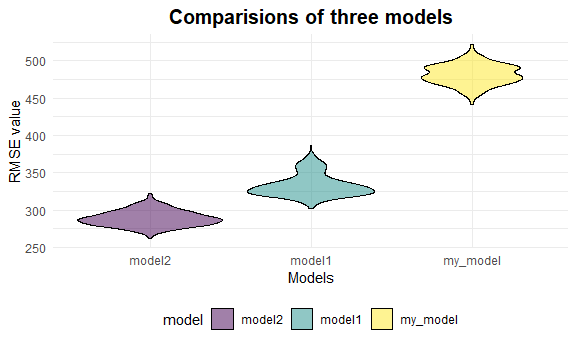

P8105 HW6
================
Chenxin Zhang
2020-12-02

## Problem 1

``` r
homicide_df =
  read_csv("./data/homicide-data.csv", na = c("", "NA", "Unknown")) %>% 
  mutate(
    city_state = str_c(city, state, sep = ", "),
    victim_age = as.numeric(victim_age),
    resolution = case_when(
      disposition == "Closed without arrest" ~ 0,
      disposition == "Open/No arrest"        ~ 0,
      disposition == "Closed by arrest"      ~ 1)
  ) %>% 
  filter(
    victim_race %in% c("White", "Black"),
    city_state != "Tulsa, AL") %>% 
  select(city_state, resolution, victim_age, victim_race, victim_sex)
```

Start with one city.

``` r
baltimore_df =
  homicide_df %>% 
  filter(city_state == "Baltimore, MD")
# fit a logistic regression with resolved vs unresolved as the outcome and victim age, sex and race as predictors. 
glm(resolution ~ victim_age + victim_race + victim_sex, 
    data = baltimore_df,
    family = binomial()) %>% 
  broom::tidy() %>% 
  mutate(
    OR = exp(estimate), # odds ratio
    CI_lower = exp(estimate - 1.96 * std.error),
    CI_upper = exp(estimate + 1.96 * std.error)
  ) %>% 
  select(term, OR, starts_with("CI")) %>% 
  knitr::kable(digits = 3)
```

| term              |    OR | CI\_lower | CI\_upper |
| :---------------- | ----: | --------: | --------: |
| (Intercept)       | 1.363 |     0.975 |     1.907 |
| victim\_age       | 0.993 |     0.987 |     1.000 |
| victim\_raceWhite | 2.320 |     1.648 |     3.268 |
| victim\_sexMale   | 0.426 |     0.325 |     0.558 |

Try this across cities.

``` r
models_results_df =
  homicide_df %>% 
  nest(data = -city_state) %>% 
  mutate(
    models = 
      map(.x = data, ~glm(resolution ~ victim_age + victim_race + victim_sex, data = .x, family = binomial())),
    results = map(models, broom::tidy)
    ) %>% 
  select(city_state, results) %>% 
  unnest(results) %>% 
  mutate(
    OR = exp(estimate), # odds ratio
    CI_lower = exp(estimate - 1.96 * std.error),
    CI_upper = exp(estimate + 1.96 * std.error)
  ) %>% 
  select(city_state, term, OR, starts_with("CI"))
```

``` r
models_results_df %>% 
  filter(term == "victim_sexMale") %>% 
  mutate(city_state = fct_reorder(city_state, OR)) %>% 
  ggplot(aes(x = city_state, y = OR)) +
  geom_point() +
  geom_errorbar(aes(ymin = CI_lower, ymax = CI_upper)) +
  theme(axis.text.x = element_text(angle = 90, vjust = 0.5, hjust = 1))
```



## Problem 2

**Import and Tidy Data** *`babysex:` baby’s sex (male = 1, female = 2)
*`frace:` father’s race (1 = White, 2 = Black, 3 = Asian, 4 = Puerto
Rican, 8 = Other, 9 = Unknown) *`mrace:` mother’s race (1 = White, 2 =
Black, 3 = Asian, 4 = Puerto Rican, 8 = Other) *`malform:` presence of
malformations that could affect weight (0 = absent, 1 = present)

``` r
#load draft data frame
#convert numeric to factor
#change pounds to grams
bw_df = read_csv("./data/birthweight.csv") %>% janitor::clean_names() %>% 
  mutate(
    babysex = factor(babysex, labels = c("male", "female")),
    frace = factor(frace, levels = c(1,2,3,4,8,9), labels = c("white", "black", "asian", "puerto rican", "other", "unknown")),
    mrace = factor(mrace, levels = c(1,2,3,4,8,9), labels = c("white", "black", "asian", "puerto rican", "other", "unknown")),
    malform = factor(malform, labels = c("absent", "present")),
  delwt = delwt * 453.59237,
    ppwt = ppwt * 453.59237,
    wtgain = wtgain * 453.59237) %>% 
  arrange(babysex, frace)
```

``` r
#there are two ways to check for missing data
sum(is.na(bw_df))
## [1] 0
which(is.na(bw_df))
## integer(0)
```

  - The dataset is consist of 4342 observations and 20 variables, and
    there is 0 missing value. The numeric variable `babysex`, `frace`,
    `mrace`, and `malform` are converted to factor variable.

**Propose a regression model for birthweight**

I am interested in how factors associated with mother can affect baby’s
birthweight, so I will choose  
`delwt:`(mother’s weight at delivery,  
`mheigth:` mother’s height (inches),  
`momage:` mother’s age at delivery (years), `smoken:` average number of
cigarettes smoked per day during pregnancy as predictors to build linear
regression model.

``` r
my_model = bw_df %>% 
  lm(bwt ~ delwt + mheight + momage + smoken, data = .) %>% 
  broom::tidy() %>% 
  knitr::kable()
my_model
```

| term        |   estimate |   std.error |  statistic | p.value |
| :---------- | ---------: | ----------: | ---------: | ------: |
| (Intercept) | 978.977072 | 178.6454819 |   5.479999 |   0e+00 |
| delwt       |   0.012720 |   0.0007991 |  15.918648 |   0e+00 |
| mheight     |  15.969731 |   3.0413201 |   5.250921 |   2e-07 |
| momage      |  15.304540 |   1.9073020 |   8.024183 |   0e+00 |
| smoken      | \-7.023537 |   0.9941971 | \-7.064532 |   0e+00 |

  - The results show a positive intercept of 978.977072, and the
    parameters of delwt, mheight, momage and smoke are 0.012720,
    15.969731, 15.304540, -7.023537 respectively. The effect of these
    four predictors on birthweight are significant, since the P-value of
    all predictors are much less than 0.05.

**model residuals against fitted values**

``` r
my_model = bw_df %>% 
  lm(bwt ~ delwt + mheight + momage + smoken, data = .) 
plot = bw_df %>% 
  add_predictions(my_model) %>% 
  add_residuals(my_model) %>% 
  rename("prediction" = pred, "residual" = resid) %>%
  ggplot(aes(x = prediction, y = residual)) +
    geom_point(size = 0.9, alpha = 0.5, color = "pink") +
    labs(title = "Plot of Residual vs prediction", x="Predicted/Fitted value(grams)", y="Residual(grames)") + 
    geom_abline(intercept = 0, slope = 0)
plot
```


\* we can not see obvious relationship between the residuals and the
predicted values from the plot above.

**Compare the three models**

  - model1 using length at birth and gestational age as predictors (main
    effects only)

<!-- end list -->

``` r
model1 = lm(bwt ~ blength + gaweeks, data = bw_df) %>% broom::tidy() %>% 
  knitr::kable()
model1
```

| term        |     estimate | std.error |  statistic | p.value |
| :---------- | -----------: | --------: | ---------: | ------: |
| (Intercept) | \-4347.66707 | 97.958360 | \-44.38281 |       0 |
| blength     |    128.55569 |  1.989891 |   64.60439 |       0 |
| gaweeks     |     27.04673 |  1.717930 |   15.74379 |       0 |

  - model2 using head circumference, length, sex, and all interactions
    (including the three-way interaction) between these

<!-- end list -->

``` r
model2 = lm(bwt ~ bhead * blength * babysex, data = bw_df) %>% broom::tidy() %>% 
  knitr::kable()
model2
```

| term                        |       estimate |    std.error |   statistic |   p.value |
| :-------------------------- | -------------: | -----------: | ----------: | --------: |
| (Intercept)                 | \-7176.8170222 | 1264.8397394 | \-5.6740920 | 0.0000000 |
| bhead                       |    181.7956350 |   38.0542051 |   4.7772811 | 0.0000018 |
| blength                     |    102.1269235 |   26.2118095 |   3.8962180 | 0.0000992 |
| babysexfemale               |   6374.8683508 | 1677.7669213 |   3.7996150 | 0.0001469 |
| bhead:blength               |    \-0.5536096 |    0.7802092 | \-0.7095656 | 0.4780117 |
| bhead:babysexfemale         |  \-198.3931810 |   51.0916850 | \-3.8830816 | 0.0001047 |
| blength:babysexfemale       |  \-123.7728875 |   35.1185360 | \-3.5244319 | 0.0004288 |
| bhead:blength:babysexfemale |      3.8780531 |    1.0566296 |   3.6702106 | 0.0002453 |

**cross validation**

``` r
#crossv_mc() will get 500 repeated sampling, each sample has sample size as the original dataset, and create train and test data
cv_df = 
  crossv_mc(bw_df, 500) %>% 
    mutate(
        train = map(train, as.tibble),
        test = map(test,as.tibble)
    )  %>%
  
  mutate(my_model  = map(train, ~lm(bwt ~ delwt + mheight + momage + smoken, data = .x)),
         model1  = map(train, ~lm(bwt ~ blength + gaweeks, data = .x)),
         model2  = map(train, ~lm(bwt ~ bhead * blength * babysex, data = .x))) %>% 
  
  mutate(rmse_my_model = map2_dbl(my_model, test, ~rmse(model = .x, data = .y)),
         rmse_model1 = map2_dbl(model1 , test, ~rmse(model = .x, data = .y)),
         rmse_model2 = map2_dbl(model2, test, ~rmse(model = .x, data = .y))) 
cv_df
## # A tibble: 500 x 9
##    train test  .id   my_model model1 model2 rmse_my_model rmse_model1
##    <lis> <lis> <chr> <list>   <list> <list>         <dbl>       <dbl>
##  1 <tib~ <tib~ 001   <lm>     <lm>   <lm>            491.        330.
##  2 <tib~ <tib~ 002   <lm>     <lm>   <lm>            477.        327.
##  3 <tib~ <tib~ 003   <lm>     <lm>   <lm>            505.        336.
##  4 <tib~ <tib~ 004   <lm>     <lm>   <lm>            480.        339.
##  5 <tib~ <tib~ 005   <lm>     <lm>   <lm>            489.        320.
##  6 <tib~ <tib~ 006   <lm>     <lm>   <lm>            489.        359.
##  7 <tib~ <tib~ 007   <lm>     <lm>   <lm>            490.        363.
##  8 <tib~ <tib~ 008   <lm>     <lm>   <lm>            472.        320.
##  9 <tib~ <tib~ 009   <lm>     <lm>   <lm>            470.        348.
## 10 <tib~ <tib~ 010   <lm>     <lm>   <lm>            488.        339.
## # ... with 490 more rows, and 1 more variable: rmse_model2 <dbl>
```

``` r
#select interested variables 
rmse_df = cv_df %>% 
select(starts_with("rmse")) %>% 
  pivot_longer(
    everything(),
    names_to = "model", 
    values_to = "rmse",
    names_prefix = "rmse_") %>%   mutate(
    model = fct_reorder(model,rmse))
rmse_df
## # A tibble: 1,500 x 2
##    model     rmse
##    <fct>    <dbl>
##  1 my_model  491.
##  2 model1    330.
##  3 model2    297.
##  4 my_model  477.
##  5 model1    327.
##  6 model2    291.
##  7 my_model  505.
##  8 model1    336.
##  9 model2    298.
## 10 my_model  480.
## # ... with 1,490 more rows
```

``` r
plot2 = rmse_df %>% 
  ggplot(aes(x = model, y = rmse)) + 
    geom_violin(aes(fill = model), color = "black", alpha = .5) +
    labs(title = "Comparisions of three models", y="RMSE value", x = "Models") 
plot2
```


\* From the plot, we can observe that `my_model` has greater RMSE than
the other two models, and `model2` has smaller RMSE than `model1`. The
results peove that prediction accuracy of `model2` is higher than the
other two. The prediction accuracy of `my_model` is too low to be a good
linear model. ter than `model1`. I would recommand use `model2` for
hypothetical analysis, or find a better model with higher prediction
accuracy.
